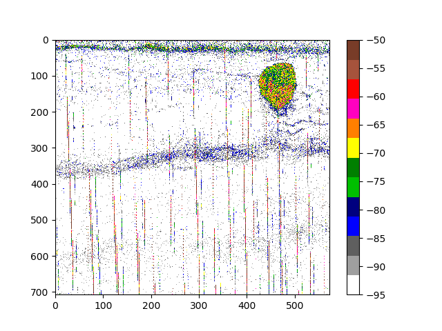
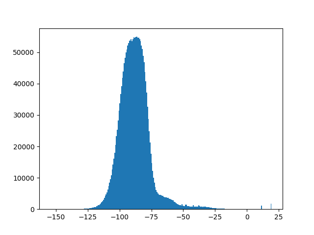

# EchoJulia

[](https://travis-ci.org/EchoJulia/EchoJulia.jl)

[](https://coveralls.io/github/EchoJulia/EchoJulia.jl?branch=master)

[](http://codecov.io/github/EchoJulia/EchoJulia.jl?branch=master)


Meta package that loads all the EchoJulia related packages for a
"batteries included" hydroacoustic data processing and analysis
environment in Julia.

We assume that you have a working Julia 1.0 system, See
https://julialang.org/.

## Simple Installation

Switch to package mode by pressing `]`

	add EchoJulia

## Installation for developers

Clone the repository

	git clone https://github.com/EchoJulia/EchoJulia.jl.git

Change into the EchoJulia.jl directory

	cd EchoJulia.jl

Start julia

	julia

Switch to package mode by pressing `]` and activate, update and precompile:

	activate .
	update
	precompile

Quit package mode by pressing `backspace`.

You should now be ready to go.

## Simple Example

Some sample acoustics files are provided for demonstration and testing purposes. `EK60_SAMPLE` is a sample
RAW file recorded with a Simrad EK60 scientific echo sounder. `ECS_SAMPLE` is a calibration supplement file
containing calibration corrections. The following snippet loads the RAW file, applies calibration and plots
a simple echogram:


	using EchoJulia
	raw = SimradRaw.load(EK60_SAMPLE)
	cal = EchoviewEcs.load(ECS_SAMPLE)
	data = transform(raw, calibration=cal)
	echogram(data["Sv38"], range = maximum(data["r38"]), vmin=-95, vmax=-50, cmap=EK500)




## Export to MATLAB

It is often desirable to export the data for further analysis. Note that the MATLAB MAT
file format is not a proprietary format, but a specialised HDF5 format.


	Pkg.add("MAT")

	using MAT
	matwrite("myfile.mat", data)
	
NB This seems to be problematic in Julia 1.0 and we are waiting for
MAT to be updated.

## Low level API

Although `load` is convenient for exploratory data analysis, we
sometimes need access to the underlying EK60 datagrams, for example,
to access the survey name or NMEA data.


	data = collect(datagrams(EK60_SAMPLE))
	name = data[1].configurationheader.surveyname


If performance matters, you might choose to access the data ping by ping:

	filename = EK60_SAMPLE # or some EK60 RAW file name

	ps = pings(filename) # Get the pings
	ps38 = [p for p in ps if p.frequency == 38000] # Just 38 kHz pings
	Sv38 = Sv(ps38) # Convert to a matrix of volume backscatter

## Histograms

Show a histogram of volume backscatter.

	eghist(data["Sv38"])



## Image processing

EchoJulia uses simple matrices and this allows interoperability with the wider
Julia scientific computing tools, especially `Images.jl`.

If you need an echogram image, the following can be useful:


	using Images
	img = imagesc(data["Sv38"])
	Images.save("myfile.png", img)


## Dependencies

```
EchoJulia
	EchogramImages
	EchogramPlots
	EchoviewEcs
	EchoviewEvr
		Filetimes
	SimradEK60
		SimradRaw
	SimradEK60TestData

AliasedSeabed
	EchogramUtils
	EchogramProcessing

EchogramPyPlot
```

## Next Steps

EchoJulia is a work in progress with more functionality coming
soon. Comments and contributions welcome.

For more information, please contact Rob Blackwell at
roback28@bas.ac.uk
